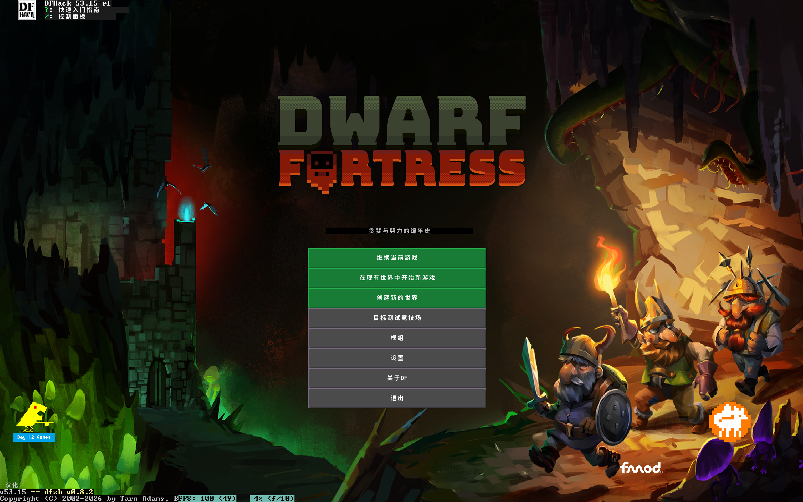
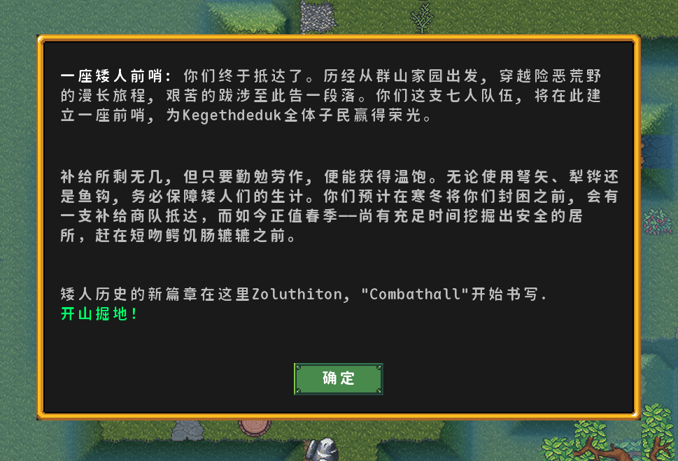
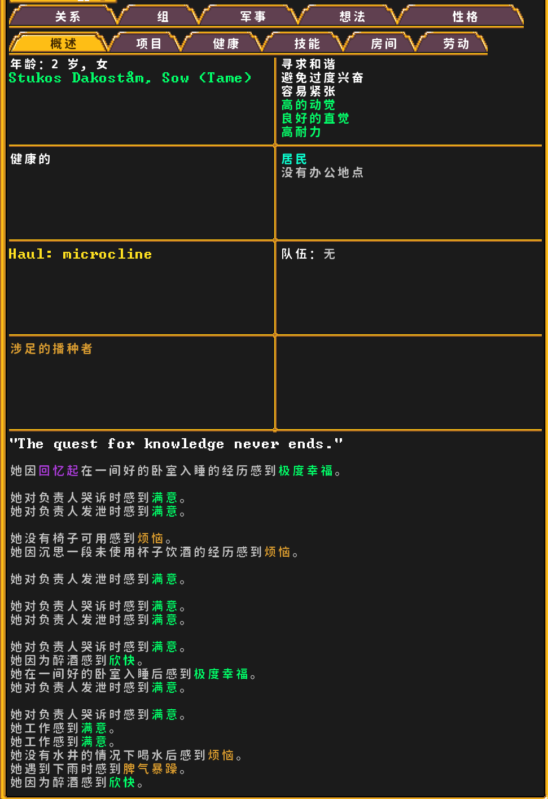
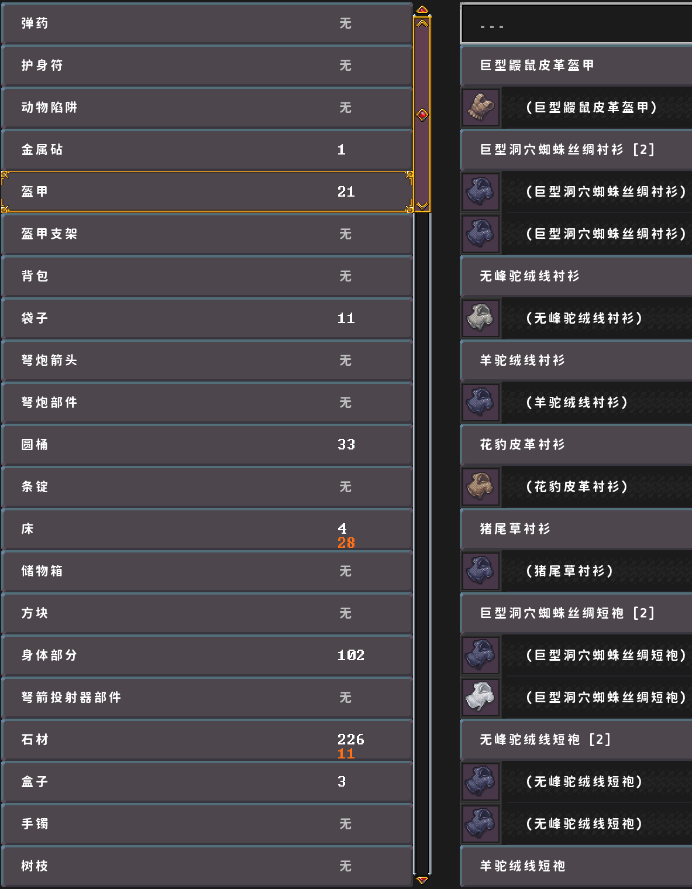
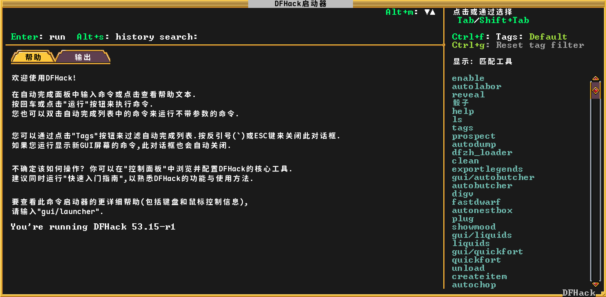
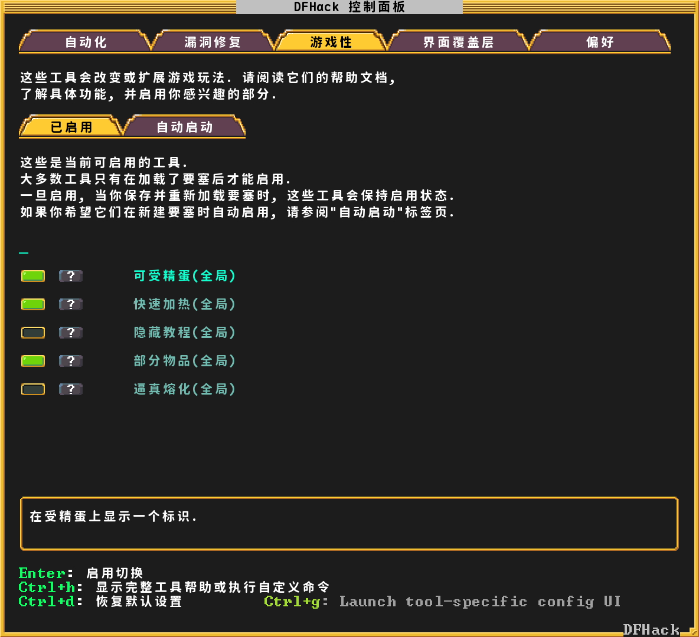

<!--
  description: Dwarf Fortress 简体中文汉化插件 (dfzh). 基于 DFHack 框架的全界面实时汉化模组，覆盖菜单、物品、生物、建筑等。
  keywords: dwarf fortress, 矮人要塞, chinese translation, 汉化, 简体中文, dfhack, 汉化补丁, 汉化包, 中文模组, localization, game mod, steam
-->

<div align="center">

# Dwarf Fortress 中文汉化插件 (dfzh)

> ⛏️🏰 矮人要塞汉化 ｜ Dwarf Fortress Simplified Chinese Mod ｜ DFHack 中文翻译插件

[](https://github.com/wodzys/dwarf-fortress-chinese/releases)
[](https://github.com/wodzys/dwarf-fortress-chinese/actions/workflows/build.yml)
[](https://github.com/wodzys/dwarf-fortress-chinese)
[](https://github.com/DFHack/dfhack/releases)
[](https://steamcommunity.com/sharedfiles/filedetails/?id=3762474859)
[](LICENSE)

**[English](README.md) | [简体中文](README.zh-CN.md)**

</div>

一款面向 **《Dwarf Fortress》（矮人要塞）** 的 **实时简体中文汉化模组**（Steam 版）。作为 **DFHack 插件** 运行，直接从游戏内存读取界面文本，实现菜单、物品描述、生物名称、建筑界面等全界面实时翻译。

> ⚡ **快速安装**：通过 [Steam 创意工坊](https://steamcommunity.com/sharedfiles/filedetails/?id=3762474859) 订阅（推荐），或参考下方手动安装步骤。

## 界面预览

### 🎮 游戏主界面
<p align="center">
  
</p>

---

### 📜 文本与角色动态

| 开局前哨简介 | 角色属性与思维动态 |
| :---: | :---: |
|  |  |

---

### 📦 物品与装备列表
<p align="center">
  
</p>

---

### 🛠️ DFHack 辅助工具支持

我们将 DFHack 的常用功能与控制面板也进行了汉化适配，方便您在游戏中使用各种辅助功能：

| DFHack 启动器 (Launcher) | DFHack 控制面板 (Control Panel) |
| :---: | :---: |
|  |  |

---

## 📦 安装方法

### Steam 创意工坊（推荐）

> **前置条件**：需要确保已安装 [DFHack](https://store.steampowered.com/app/2346660) 53.14+。

1. 在 [Steam 创意工坊](https://steamcommunity.com/sharedfiles/filedetails/?id=3762474859) 订阅本模组
2. 启动游戏 — 插件会自动启用（左下角会出现 **「汉化」** 字样）
3. 按 **Ctrl-Alt-K** 即可切换中文显示

### 手动安装

1. 安装 [DFHack](https://github.com/DFHack/dfhack/releases) 53.14+（适用于 Dwarf Fortress）
2. 从 [Releases](https://github.com/wodzys/dwarf-fortress-chinese/releases) 下载最新的 `dfzh-v*.*.*-**.**-**-win64.zip`
3. 将压缩包解压到 DF 的模组目录：
   ```
   C:\Users\<你的用户名>\AppData\Roaming\Bay 12 Games\Dwarf Fortress\mods\
   ```
   解压后的文件夹名类似 `dfzh-v0.8.2-53.15-r1`，目录层次如：
   ```
   ***\Dwarf Fortress\mods\dfzh-v0.8.2-53.15-r1\info.txt
   ```
4. 启动游戏 — 插件会自动加载（左下角会出现 **「汉化」** 字样）
5. 按 **Ctrl-Alt-K** 即可切换中文显示

> **反馈问题**：[GitHub Issues](https://github.com/wodzys/dwarf-fortress-chinese/issues)

---

## ✨ 功能特点

- **全界面实时汉化** — 菜单、物品、生物、建筑、公告等所有界面文本即时翻译
- **两层级翻译引擎**：CSV 精确匹配词典 + TOML 递归重写规则引擎（处理材料+物品等复合文本）
- **智能句子检测** — 基于位置、大小写和标点规则将单字符组合为句子
- **TTF 中文字体渲染** — 动态加载 SDL2_ttf，支持多种字号和渲染模式
- **颜色保留** — 翻译过程中保留原文本颜色，支持动态颜色实时更新
- **未翻译文本收集** — 自动收集未匹配文本（FIFO，上限 2000 条），一键导出

---

## ⌨️ 使用说明

安装完成后（通过 Steam 创意工坊或手动解压），插件会在游戏启动时自动加载。左下角会出现 **「汉」** 字，按 **Ctrl-Alt-K** 即可切换中文显示。

### 快捷键

| 快捷键 | 命令 | 功能 |
|--------|------|------|
| `Ctrl-Alt-L` | `dfzh save_untrans` | 导出未翻译文本到日志 |
| `Ctrl-Alt-R` | `dfzh reload_dicts` | 重新加载词典和规则集，清空纹理缓存 |
| `Ctrl-Alt-K` | `dfzh show_ch` | 切换中文翻译显示开/关 |

---

## ❓ 常见问题

**问：支持 Steam 版 Dwarf Fortress 吗？**  
答：支持！插件已在 Steam 版 Dwarf Fortress 上测试通过。

**问：需要单独安装 DFHack 吗？**  
答：需要。本插件是 DFHack 插件，依赖 DFHack 53.14+。参见 [DFHack 安装指南](https://docs.dfhack.org/en/stable/docs/installing.html)。

**问：汉化覆盖了哪些内容？**  
答：插件实时翻译游戏屏幕上的所有界面文本——菜单、按钮、物品描述、生物名称、建筑界面、公告等。翻译数据由社区维护并持续扩充。

**问：如何反馈翻译问题或缺失文本？**  
答：使用 `Ctrl-Alt-L` 导出未翻译文本，然后在 [GitHub Issues](https://github.com/wodzys/dwarf-fortress-chinese/issues) 提交反馈，或通过[矮人要塞中文维基](https://dfzh.huijiwiki.com/)参与翻译贡献。

**问：可以使用自己喜好的字体吗？**  
答：可以。在 `data/dfzh_config.txt` 中设置 `FONT_FILE` 为你的 TTF 字体路径即可。

---

## ⚙️ 配置说明

编辑 `data/dfzh_config.txt`（`[KEY:VALUE]` 格式），路径相对于 `<hack>/data/dfzh/`：

| 配置项 | 说明 | 默认值 |
|--------|------|--------|
| `FONT_FILE` | TTF 字体文件路径 | `fonts/MapleMonoNL-CN-Bold.ttf` |
| `LOG_FILE` | 日志文件路径 | `logs/dfzh.log` |
| `DICT_EXACT` | 精确匹配词典文件 | `dfzh_dict_exact.csv` |
| `DICT_WORD` | 单词级词典文件 | `dfzh_dict_word.csv` |

### 词典格式

CSV 三字段：`"英文","翻译","控制"`。示例：

```csv
"Continue Playing","继续游戏",
"DFHack Launcher","DFHack启动器","c"
"Hello World","你好 \a#FF0000世界\a","s"
```

---

<details>
<summary><b>🔧 技术架构</b>（点击展开）</summary>

### 每帧渲染流程

```
屏幕缓冲区 (DF 内存: gps.screen / gps.screen_top)
       │
       ▼
SentenceDetector.detectSentences()    字符级 → 句子/词语分组
       │
       ▼
ScreenManager::processTranslations()
  ├─ 1. DICTIONARY.tryTranslate()     CSV 精确匹配（数字归一化）
  └─ 2. RULESETS.translate()          TOML 规则引擎（递归重写 + @placeholder）
       │
       ▼
TTFManager::RenderBlendedText()       中文 TTF → SDL_Surface → SDL_Texture
       │
       ▼
LRU 纹理缓存 (500 条)               命中复用，未命中重生成
       │
       ▼
SDL_RenderCopy (via g_sdl2 hooks)    叠加到游戏画面
```

### 核心模块

| 模块 | 职责 |
|------|------|
| **ScreenManager** | 核心调度器：缓冲区处理、翻译分发、纹理缓存与渲染 |
| **DictManager** | CSV 词典：精确匹配 + 数字归一化，线程安全 |
| **RulesetsManager** | TOML 规则引擎：递归重写、`@placeholder` 捕获、循环检测、LRU 记忆化缓存 |
| **SentenceDetector** | 字符级文本检测，编译期查找表 |
| **TTFManager** | 运行时 SDL2_ttf 加载，按像素高度匹配字体 |
| **LoggerManager** | spdlog 异步日志：滚动文件（10MB×3）+ 未翻译文本独立日志 |

</details>

---

## 🏗️ 从源码构建

DFHack 插件需在 DFHack 源码树中编译：

1. 将本目录放入 DFHack 源码的 `plugins/df_chinese/`
2. 编辑 `build/win64/DF_PATH.txt` 指向你的游戏安装路径
3. 打开 **x64 Native Tools Command Prompt for VS 2022**，依次执行：

```batch
cd build\win64
generate-MSVC-gui.bat
build-debug.bat
install-debug.bat
```

依赖（vcpkg 管理）：detours、spdlog、tomlplusplus。SDL2_ttf 在 CMake 配置时自动下载。

参见 [DFHack 编译指南](https://docs.dfhack.org/en/stable/docs/dev/compile/Compile.html#windows) 了解完整环境搭建。

---

## 🙏 致谢

### 算法参考
规则翻译引擎（RulesetsManager）受 [DFI18n/dfi18n](https://github.com/DFI18n/dfi18n)（MIT）启发并在 C++ 中独立实现。优化包括 LRU 记忆化缓存、编译期查找表和 heterogeneous lookup。

### 翻译数据
版权归属于[矮人要塞中文维基](https://dfzh.huijiwiki.com/)翻译组，在 [CC BY-NC 4.0](https://creativecommons.org/licenses/by-nc/4.0/deed.zh-hans) 协议下授权使用。

### 第三方库
| 库 | 许可 |
|----|------|
| [spdlog](https://github.com/gabime/spdlog) | MIT |
| [toml++](https://github.com/marzer/tomlplusplus) | MIT |
| [Microsoft Detours](https://github.com/microsoft/Detours) | MIT |
| [SDL2_ttf](https://github.com/libsdl-org/SDL_ttf) | zlib |
| [Maple Mono NF CN](https://github.com/subframe7536/maple-font) | SIL OFL 1.1 |

---

## 📄 许可证

源代码（C++）— **MIT**。  
翻译数据（`data/rulesets/`）— **CC BY-NC 4.0**。  
字体（`data/fonts/`）— **SIL Open Font License 1.1**。

Copyright (c) 2026 0x53an
